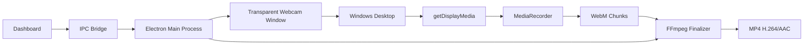
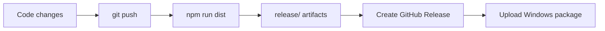

<div align="center">

# 🎬 Teaching Studio

### A Windows-first desktop recording studio for educators, trainers & creators.

<p>
  <a href="https://github.com/RICK2814/teaching-studio/releases/latest">
    
  </a>
  
  
  
  
</p>

<p>
  <a href="https://github.com/RICK2814/teaching-studio/releases/latest">⬇️ Download</a>
  ·
  <a href="https://github.com/RICK2814/teaching-studio/issues">🐛 Report a bug</a>
  ·
  <a href="https://github.com/RICK2814/teaching-studio/issues">💡 Request a feature</a>
</p>


</div>

> **Teaching Studio** lets you capture your Windows desktop, keep a webcam bubble on top, replace the camera background, control audio, and export a finished MP4 — without OBS.

---

## 🧭 Quick Navigation

<details open>
<summary><b>Explore the project</b></summary>

- [✨ Highlights](#-highlights)
- [⚡ Why Teaching Studio](#-why-teaching-studio)
- [🧠 Architecture](#-architecture)
- [🔄 Recording Pipeline](#-recording-pipeline)
- [🛠️ Stack](#️-technology-stack)
- [🚀 Development](#-development-setup)
- [📦 Build & Release](#-production-build)
- [🎬 Usage](#-using-the-app)
- [⌨️ Hotkeys](#️-hotkeys)
- [📁 Structure](#-project-structure)
- [🧪 Verification](#-verification-checklist)
- [🗺️ Roadmap](#️-roadmap)
- [⚠️ Limitations](#️-known-limitations)

</details>

---

## ✨ Highlights

<div align="center">

| 🖥️ Capture | 🎥 Camera | 🎨 Background | 🎙️ Audio |
|:---:|:---:|:---:|:---:|
| Full desktop | Floating bubble | Segmentation | Mic + system |
| Any Windows app | Always on top | Presets + custom | Configurable |

| ⚡ Encoding | 💾 Recovery | ⌨️ Controls | 🪟 Native |
|:---:|:---:|:---:|:---:|
| Hardware-aware | Chunk-safe | Global hotkeys | Electron |
| FFmpeg fallback | Interrupted-session data | F7/F8/F9/F10 | Windows x64 |

</div>

### 🎯 Built for teaching

```text
Open your lesson
      │
      ▼
┌─────────────────────┐
│   Teaching Studio   │
│                     │
│  🖥️ Desktop capture │
│  🎥 Camera bubble   │
│  🎨 Background      │
│  🎙️ Audio controls  │
└──────────┬──────────┘
           │
           ▼
       🎞️ Final MP4
```

The goal is simple: **start teaching faster, stay visible, and spend less time configuring recording software.**

---

## ⚡ Why Teaching Studio?

<table>
<tr>
<th>Typical workflow</th>
<th>Teaching Studio</th>
</tr>
<tr>
<td>Configure scenes manually</td>
<td>✅ Open → configure → record</td>
</tr>
<tr>
<td>Build camera compositing setup</td>
<td>✅ Native transparent overlay</td>
</tr>
<tr>
<td>Manage several capture sources</td>
<td>✅ One recording pipeline</td>
</tr>
<tr>
<td>Manually think about encoding</td>
<td>✅ Hardware-aware FFmpeg finalization</td>
</tr>
<tr>
<td>Recover interrupted media manually</td>
<td>✅ Incremental recording chunks</td>
</tr>
</table>

---

## 🎞️ Visual Demo Surface

<div align="center">

> 🎥 **Tip:** Drop a product GIF or screenshot at `docs/demo.gif` to turn this section into an animated showcase.


<sub>Recommended: 6–10 second loop showing dashboard → recording → overlay → exported video.</sub>

</div>

---

## 🧩 Feature Matrix

| Capability | What it does |
|---|---|
| 🖥️ **Full-screen recording** | Capture YouTube, browsers, PDFs, PowerPoint, VS Code, and other Windows apps. |
| 🎥 **Floating webcam bubble** | Transparent, always-on-top camera window that stays visible while you teach. |
| ✂️ **Background replacement** | Segmentation-based removal with presets and custom backgrounds. |
| 🎙️ **Microphone + system audio** | Configure lecture audio directly from the dashboard. |
| ⚡ **Hardware-aware encoding** | FFmpeg finalization tries available hardware encoders before software fallback. |
| 💾 **Crash-safe chunks** | Recording data is written incrementally so interrupted sessions can leave recoverable media. |
| ⌨️ **Global hotkeys** | Control recording, camera and microphone without returning to the dashboard. |
| 🪟 **Native Windows experience** | Packaged as a Windows x64 Electron app; no Python runtime required. |

---

## 🧠 Architecture

Teaching Studio uses a **desktop-overlay architecture** rather than doing all webcam compositing inside a single renderer.



### 🔬 The interesting part

The webcam bubble is implemented as a **real transparent, always-on-top Windows window**. Because Windows composes that window into the desktop, the screen capture pipeline can capture a desktop that already contains the webcam overlay.

That means the application can avoid building a second, tightly synchronized camera/screen compositing path for the main recording flow.

---

## 🔄 Recording Pipeline

```text
┌──────────────────┐
│  Select display  │
└────────┬─────────┘
         ▼
┌──────────────────┐      ┌────────────────────┐
│ getDisplayMedia  │◄────►│ Webcam overlay     │
└────────┬─────────┘      │ always on top      │
         │                └────────────────────┘
         ▼
┌──────────────────┐
│  MediaRecorder   │
│   WebM chunks    │
└────────┬─────────┘
         ▼
┌──────────────────┐
│ Incremental disk │
│      writes      │
└────────┬─────────┘
         ▼
┌──────────────────┐
│      FFmpeg      │
│ hardware → SW    │
└────────┬─────────┘
         ▼
┌──────────────────┐
│    Final MP4     │
│    H.264/AAC     │
└──────────────────┘
```

### 🧱 Reliability model

```text
Record
  │
  ├── chunk 001 ──┐
  ├── chunk 002 ──┤
  ├── chunk 003 ──┼──► recoverable temp media
  ├── chunk 004 ──┤
  └── chunk 005 ──┘
                    │
                    ▼
                 finalize
                    │
                    ▼
                 final.mp4
```

---

## 🛠️ Technology Stack

<div align="center">

| Layer | Technology |
|---|---|
| 🖥️ Desktop runtime | Electron 30 |
| 🎨 UI | React 18 |
| 🧠 Language | TypeScript 5 |
| ⚙️ Build | electron-vite + Vite |
| 💅 Styling | Tailwind CSS |
| 🧍 Segmentation | MediaPipe Tasks Vision |
| 🎥 Capture | `getDisplayMedia()` + `MediaRecorder` |
| 🎞️ Processing | FFmpeg via `ffmpeg-static` |
| 💾 Persistence | `electron-store` |
| 📦 Packaging | electron-builder |
| 🪟 Target | Windows x64 / NSIS |

</div>

### 🔗 Runtime relationship

```text
React Renderer
     │
     ▼
Preload Bridge
     │
     ▼
Electron Main ───────────┐
     │                    │
     ├── Overlay Window   │
     ├── Recorder         │
     ├── Global Hotkeys   │
     └── Persistent Store │
                          ▼
                        FFmpeg
```

---

## 📦 Download

<div align="center">

### 🚀 Latest Windows Build

<a href="https://github.com/RICK2814/teaching-studio/releases/latest">

</a>

</div>

### Current release

**v1.0.0 — Windows portable release**

[Download `Teaching-Studio-1.0.0-win-x64-portable.zip`](https://github.com/RICK2814/teaching-studio/releases/download/v1.0.0/Teaching-Studio-1.0.0-win-x64-portable.zip)

### Portable installation

```text
1. Download the win-x64-portable.zip
2. Extract it
3. Launch Teaching Studio.exe
4. Finish the first-run setup
5. Start teaching 🎓
```

The portable package does not require a separate Node.js, Python, or Electron runtime.

---

## 🚀 Development Setup

### Requirements

- Windows 10 or Windows 11 for real device testing
- Node.js 18+
- npm
- Git

### Clone

```powershell
git clone https://github.com/RICK2814/teaching-studio.git
cd teaching-studio
```

### Install

```powershell
npm install
```

### Launch

```powershell
npm run dev
```

> 💡 Development runs the Electron application with hot reload.

---

## 🧰 Project Commands

| Command | Purpose |
|---|---|
| `npm run dev` | Start Electron in development mode |
| `npm run typecheck` | Run TypeScript checks without emitting files |
| `npm run build` | Build main, preload, and renderer bundles |
| `npm run dist` | Package a Windows x64 distributable |
| `npm run dist:dir` | Create an unpacked Windows build for smoke testing |

### 🧪 Recommended developer loop

```text
edit
 ↓
npm run typecheck
 ↓
npm run build
 ↓
npm run dist:dir
 ↓
smoke test
 ↓
npm run dist
```

---

## 🏗️ Production Build

### Standard build

```powershell
npm run dist
```

Artifacts are written to `release/`.

The Windows packaging configuration targets an **x64 NSIS installer** with:

- optional installation directory
- desktop shortcut
- application icon from `resources/icon.ico`
- unsigned Windows binaries by default

### Unpacked smoke test

```powershell
npm run dist:dir
```

Output:

```text
release/win-unpacked/
```

---

## 📤 Release / Deployment

Teaching Studio is distributed through **GitHub Releases**.



Typical version progression:

```text
v1.0.0  →  v1.0.1  →  v1.0.2  →  v1.1.0
```

> GitHub Releases and GitHub Actions are separate concerns. Add a workflow when you want GitHub to build and package releases automatically.

---

## 🎬 Using the App

```text
┌─────────────────────────────┐
│ 1. First-run setup          │
│    Camera · Mic · Quality   │
└──────────────┬──────────────┘
               ▼
┌─────────────────────────────┐
│ 2. Configure overlay        │
│    Shape · Size · Position  │
└──────────────┬──────────────┘
               ▼
┌─────────────────────────────┐
│ 3. Start recording          │
│    Dashboard → F9           │
└──────────────┬──────────────┘
               ▼
┌─────────────────────────────┐
│ 4. Teach                     │
│    Bubble stays on top      │
└──────────────┬──────────────┘
               ▼
┌─────────────────────────────┐
│ 5. Stop & Save              │
│    F10 → MP4                │
└─────────────────────────────┘
```

### 🎛️ During recording

- Drag the webcam bubble into position.
- Lock the bubble to prevent accidental movement.
- Press **F8** to toggle the camera.
- Press **F7** to toggle the microphone.
- Press **F10** or choose **Stop & Save**.

The default output location is:

```text
Videos/Teaching Studio/
```

---

## ⌨️ Hotkeys

| Hotkey | Action |
|:---:|---|
| `F9` | Start recording |
| `F10` | Stop and save |
| `F8` | Toggle camera |
| `F7` | Toggle microphone |

> 🧩 A dedicated in-app hotkey editor is planned.

---

## 📁 Project Structure

```text
src/
├── main/
│   ├── main.ts                 # Electron main process + IPC
│   ├── overlayWindow.ts        # Transparent always-on-top window
│   ├── recorder.ts             # Chunk writer + FFmpeg pipeline
│   ├── store.ts                # Persistent settings/history
│   ├── hotkeys.ts              # Global shortcut registration
│   ├── env.ts                  # Environment helpers
│   ├── preload-dashboard.ts    # Dashboard bridge
│   └── preload-overlay.ts      # Overlay bridge
│
├── renderer/
│   ├── dashboard/
│   │   ├── App.tsx
│   │   ├── ui.tsx
│   │   ├── RecordingHistory.tsx
│   │   ├── FirstRunWizard.tsx
│   │   └── recordingEngine.ts
│   │
│   ├── overlay/
│   │   ├── App.tsx
│   │   └── compositor.ts
│   │
│   └── globals.css
│
└── shared/
    └── types.ts                # Shared settings + IPC types
```

---

## 🧪 Verification Checklist

Before shipping a new Windows build, test the packaged application on an actual Windows 10/11 machine.

### 🎥 Recording

- [ ] Camera ON/OFF during recording
- [ ] Microphone ON/OFF during recording
- [ ] Start/stop repeatedly
- [ ] 5+ minute continuous recording
- [ ] Audio/video synchronization after export

### 🪟 Overlay

- [ ] Webcam bubble stays above teaching content
- [ ] Dragging is smooth
- [ ] Lock Position prevents movement
- [ ] Bubble resizing behaves correctly
- [ ] No rectangular webcam background appears

### 🎨 Background replacement

- [ ] Every preset
- [ ] Custom image
- [ ] Hair/shoulder/clothing edge quality

### 🧑‍💻 Application switching

- [ ] YouTube / browser
- [ ] PDF
- [ ] PowerPoint
- [ ] Google Docs / Sheets
- [ ] VS Code
- [ ] Other Windows applications

### 🎞️ Export

- [ ] MP4 opens in a standard player
- [ ] Expected audio is present
- [ ] Audio/video remains synchronized
- [ ] Webcam bubble appears in captured frames
- [ ] No unexpected green fringing or webcam rectangle

---

## 📴 Offline MediaPipe Model

By default, the segmentation runtime/model can load from Google's CDN on first use and can subsequently benefit from Chromium/OS caching.

For fully offline first-run environments, bundle the MediaPipe WASM runtime and `selfie_segmenter.tflite` under:

```text
resources/mediapipe/
```

Then update the corresponding paths in `src/renderer/overlay/compositor.ts` to load local resources.

---

## 🛡️ Windows Defender / SmartScreen

The current Windows packaging configuration is **unsigned**. Unsigned Windows applications/installers may trigger SmartScreen warnings on first launch.

For broader distribution, sign the Windows package with an Authenticode certificate and configure the corresponding `electron-builder` signing settings.

---

## ⚠️ Known Limitations

| Area | Current state |
|---|---|
| 🖥️ Multi-monitor presets | Presets target the primary display work area; dragging to another display is supported. |
| ⌨️ Hotkey editor | Stored hotkeys exist, but a full key-rebinding UI is not implemented yet. |
| 🧯 Recovery UI | Recovery data can be detected, but one-click recovery UX is still planned. |
| 🪟 Windows validation | Capture, transparency, and encoder behavior should be validated on target hardware. |

---

## 🗺️ Roadmap

```text
NOW
 │
 ├── ✅ Core recording pipeline
 ├── ✅ Webcam overlay
 ├── ✅ Background replacement
 ├── ✅ Audio controls
 │
 ▼
NEXT
 │
 ├── ☐ In-app hotkey editor
 ├── ☐ One-click recovery UI
 ├── ☐ Better multi-monitor presets
 ├── ☐ More webcam shapes/layout presets
 │
 ▼
LATER
 │
 ├── ☐ Automated Windows releases
 ├── ☐ Code signing
 └── ☐ Additional quality/export profiles
```

---

## 🐛 Troubleshooting

See [`TROUBLESHOOTING.md`](TROUBLESHOOTING.md) for common issues and fixes.

When filing a bug, include:

```text
OS version
Teaching Studio version
CPU / GPU
Steps to reproduce
Expected behavior
Actual behavior
Relevant logs/screenshots
```

---

## 🤝 Contributing

Pull requests and issue reports are welcome.

A good contribution usually follows this flow:

```text
Fork → Branch → Change → Typecheck → Build → Test → Pull Request
```

For larger changes, open an issue first so the design can be discussed before implementation.

---

## 📄 License

This project is licensed under the [MIT License](LICENSE).

---

<div align="center">


### 🎓 Teaching Studio

**Record your lesson, not your setup.**

<sub>Built with Electron · React · TypeScript · FFmpeg · MediaPipe</sub>

</div>
