<div align="center">

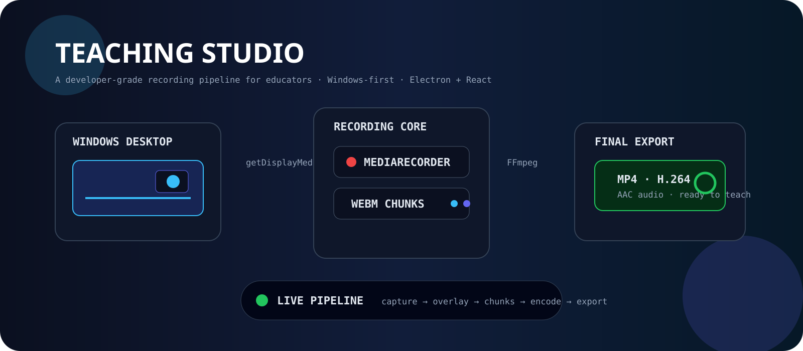

# 🎬 Teaching Studio

### **Record the lesson. Not the setup.**

A Windows-first desktop recording studio for educators, trainers and creators — screen capture, always-on-top webcam, background replacement, audio controls and MP4 export in one workflow.

<p>
<a href="https://github.com/RICK2814/teaching-studio/releases/latest"></a>
<a href="https://github.com/RICK2814/teaching-studio/stargazers"></a>
<a href="https://github.com/RICK2814/teaching-studio/issues"></a>

</p>

<p>
<a href="https://github.com/RICK2814/teaching-studio/releases/latest">⬇️ Download</a> ·
<a href="https://youtu.be/mKT4hKMhg3k">▶️ Watch demo</a> ·
<a href="https://github.com/RICK2814/teaching-studio/issues">🐛 Report a bug</a> ·
<a href="https://github.com/RICK2814/teaching-studio/issues">💡 Request a feature</a>
</p>

</div>

---

## ⚡ See the system move

<div align="center">
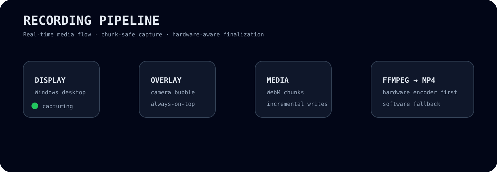
</div>

> **Repository-hosted visual pipeline:** the animation assets live inside the repository so the README does not depend on a placeholder demo URL.

---

## 🎥 Real-world demo

This is the workflow Teaching Studio is built for: teach from a real desktop application while the webcam remains visible as a floating, rounded, always-on-top bubble.

<div align="center">
<a href="https://youtu.be/mKT4hKMhg3k">

</a>

**▶️ Watch the full Teaching Studio demonstration**

`Desktop content → Floating webcam → Teach → Stop → Export MP4`
</div>

---

## 🧭 Navigation

<details open>
<summary><b>Explore</b></summary>

- [✨ Highlights](#-highlights)
- [🎞️ Animated pipeline](#-see-the-system-move)
- [🎥 Real-world demo](#-real-world-demo)
- [🧠 Architecture](#-architecture)
- [🧩 Features](#-features)
- [🛠️ Stack](#️-technology-stack)
- [🚀 Development](#-development-setup)
- [📦 Build & Release](#-build--release)
- [🎬 Usage](#-usage)
- [⌨️ Hotkeys](#️-hotkeys)
- [📁 Project Structure](#-project-structure)
- [🧪 Verification](#-verification)
- [🗺️ Roadmap](#️-roadmap)
- [⚠️ Limitations](#️-limitations)

</details>

---

## ✨ Highlights

<div align="center">
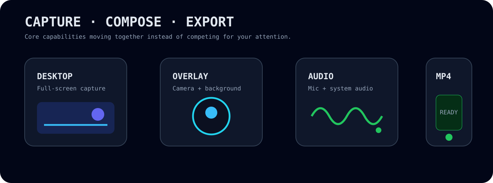
</div>

| Capability | Implementation |
|---|---|
| 🖥️ Desktop capture | `getDisplayMedia()` |
| 🎥 Floating camera | Transparent always-on-top Electron window |
| 🎨 Background replacement | MediaPipe Tasks Vision segmentation |
| 🎙️ Audio | Microphone + system audio controls |
| ⚡ Encoding | FFmpeg with hardware → software fallback |
| 💾 Recovery | Incremental recording chunks |
| ⌨️ Hotkeys | F7 / F8 / F9 / F10 |
| 🪟 Platform | Windows x64 Electron desktop app |

**Less setup. More teaching.**

---

## 🧠 Architecture

<div align="center">
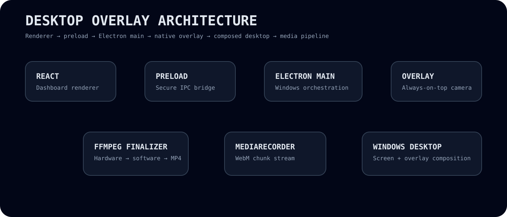
</div>

Teaching Studio separates the dashboard, native overlay and recording finalization responsibilities instead of forcing everything into one renderer.

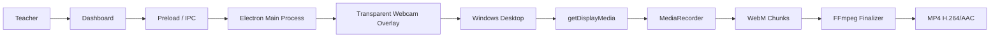

### 🔬 Why the overlay approach matters

The webcam bubble is a **real transparent, always-on-top desktop window**. Windows composes that overlay into the desktop, allowing the screen-capture path to capture a composed desktop view that already includes the camera bubble.

---

## 🔄 Recording Pipeline

<div align="center">

</div>

```text
Select display → getDisplayMedia() → MediaRecorder → WebM chunks → FFmpeg → final MP4
```

### 💾 Crash-aware media flow

Incremental chunks keep temporary media recoverable when a recording is interrupted before finalization.

---

## 🧩 Features

<div align="center">
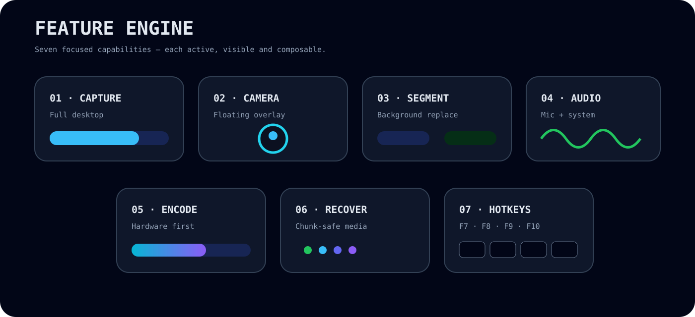
</div>

### 🖥️ Full desktop recording
Capture YouTube, browsers, PDFs, PowerPoint, VS Code and other Windows applications.

### 🎥 Floating webcam bubble
A transparent, always-on-top camera window stays visible while you teach.

### 🎨 Background replacement
Use segmentation-based removal with presets and custom backgrounds.

### 🎙️ Microphone + system audio
Configure lecture audio directly from the dashboard.

### ⚡ Hardware-aware encoding
The FFmpeg finalization pipeline tries available hardware encoders before software fallback.

### 💾 Crash-safe chunks
Recording data is written incrementally so interrupted sessions can leave recoverable temporary media.

### ⌨️ Global hotkeys
Control core recording actions without returning to the dashboard.

---

## 🛠️ Technology Stack

<div align="center">
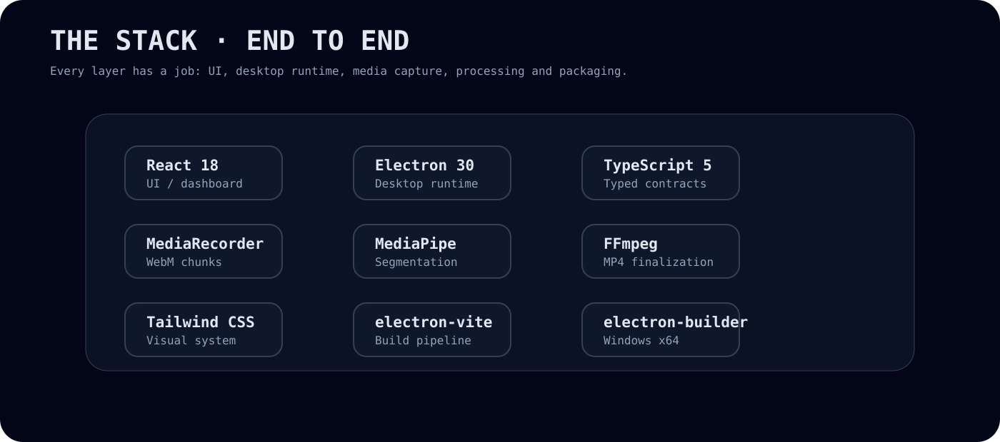
</div>

| Layer | Technology |
|---|---|
| 🖥️ Desktop runtime | Electron 30 |
| 🎨 UI | React 18 |
| 🧠 Language | TypeScript 5 |
| ⚙️ Build | electron-vite + Vite |
| 💅 Styling | Tailwind CSS |
| 🧍 Segmentation | MediaPipe Tasks Vision |
| 🎥 Capture | `getDisplayMedia()` + `MediaRecorder` |
| 🎞️ Processing | FFmpeg via `ffmpeg-static` |
| 💾 Persistence | `electron-store` |
| 📦 Packaging | electron-builder |
| 🪟 Target | Windows x64 / NSIS |

---

## 📦 Download

<div align="center">
<a href="https://github.com/RICK2814/teaching-studio/releases/latest"></a>

### Current release

**v1.0.0 — Windows portable release**

<a href="https://github.com/RICK2814/teaching-studio/releases/download/v1.0.0/Teaching-Studio-1.0.0-win-x64-portable.zip">Teaching-Studio-1.0.0-win-x64-portable.zip</a>
</div>

### Portable install

```text
1. Download the portable ZIP
2. Extract it
3. Launch Teaching Studio.exe
4. Complete first-run setup
5. Press F9 and start teaching
```

No separate Python, Node.js or Electron runtime is required for the packaged portable build.

---

## 🚀 Development Setup

<div align="center">
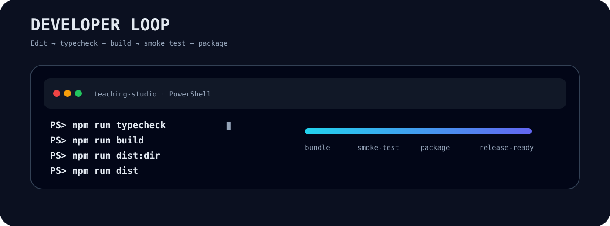
</div>

### Requirements

- Windows 10 or Windows 11 for real device testing
- Node.js 18+
- npm
- Git

### Clone

```powershell
git clone https://github.com/RICK2814/teaching-studio.git
cd teaching-studio
```

### Install

```powershell
npm install
```

### Run

```powershell
npm run dev
```

---

## 🧰 Project Commands

| Command | Purpose |
|---|---|
| `npm run dev` | Development mode with hot reload |
| `npm run typecheck` | TypeScript validation |
| `npm run build` | Build main, preload and renderer bundles |
| `npm run dist` | Build a Windows x64 distributable |
| `npm run dist:dir` | Build an unpacked Windows app for smoke testing |

---

## 📦 Build & Release

<div align="center">
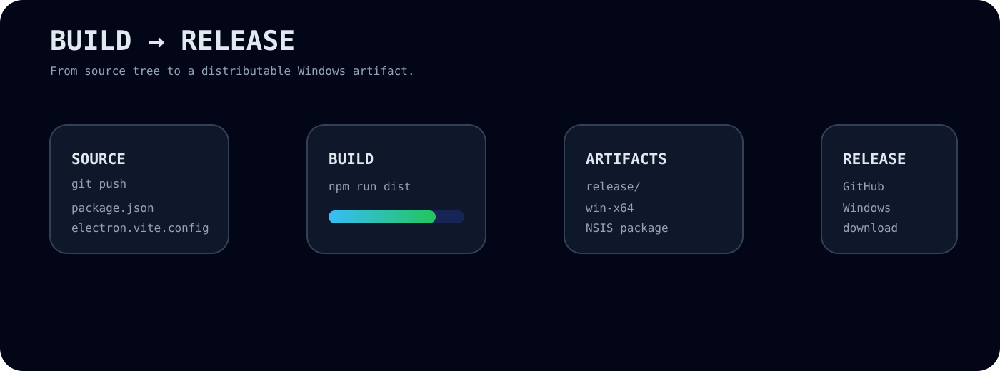
</div>

### Standard build

```powershell
npm run dist
```

### Unpacked build

```powershell
npm run dist:dir
```

Output:

```text
release/win-unpacked/
```

The Windows packaging configuration targets x64 and uses NSIS. Current binaries are unsigned by default.

---

## 🎬 Usage

<div align="center">

</div>

### Real teaching flow

```text
1. FIRST RUN → Camera · Microphone · Quality · Background
2. OVERLAY  → Shape · Size · Position · Border · Shadow
3. RECORD   → Dashboard → F9
4. TEACH    → Bubble stays on top of the desktop content
5. CONTROL  → F7 mic · F8 camera
6. FINISH   → F10 → MP4
```

### What the real demo shows

Teaching Studio is designed for exactly this kind of session: a PDF, browser, presentation or code editor can remain the main teaching surface while the **floating webcam bubble stays visible above it**.

<a href="https://youtu.be/mKT4hKMhg3k">▶️ Watch the real-world demo on YouTube</a>

Default output location:

```text
Videos/Teaching Studio/
```

---

## ⌨️ Hotkeys

<div align="center">

</div>

| Key | Action |
|:---:|---|
| `F9` | Start recording |
| `F10` | Stop and save |
| `F8` | Toggle camera |
| `F7` | Toggle microphone |

A full in-app hotkey editor is planned.

---

## 📁 Project Structure

<div align="center">
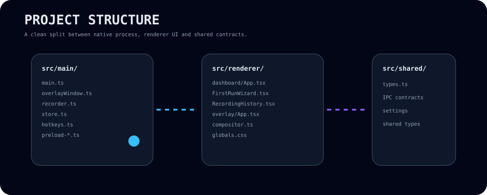
</div>

```text
src/
├── main/
│   ├── main.ts
│   ├── overlayWindow.ts
│   ├── recorder.ts
│   ├── store.ts
│   ├── hotkeys.ts
│   ├── env.ts
│   ├── preload-dashboard.ts
│   └── preload-overlay.ts
│
├── renderer/
│   ├── dashboard/
│   │   ├── App.tsx
│   │   ├── ui.tsx
│   │   ├── RecordingHistory.tsx
│   │   ├── FirstRunWizard.tsx
│   │   └── recordingEngine.ts
│   │
│   ├── overlay/
│   │   ├── App.tsx
│   │   └── compositor.ts
│   │
│   └── globals.css
│
└── shared/
    └── types.ts
```

---

## 🧪 Verification

<div align="center">
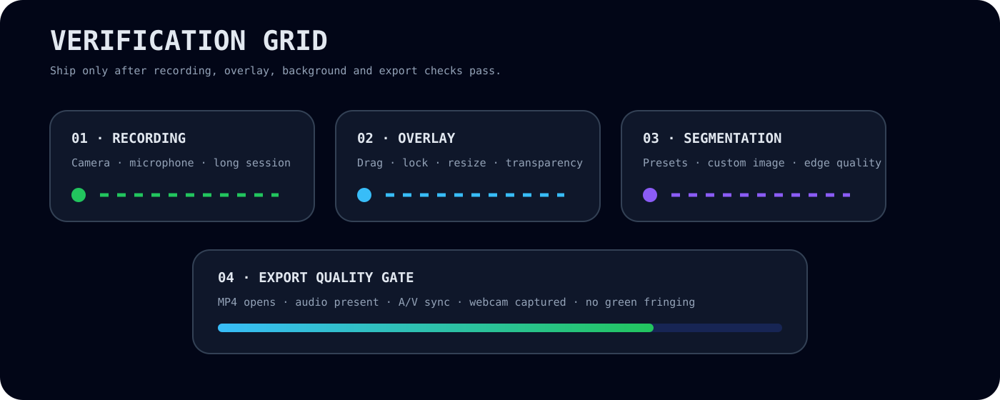
</div>

Before shipping a Windows build, validate it on an actual Windows 10/11 machine.

### Recording

- Camera ON/OFF during recording
- Microphone ON/OFF during recording
- Repeated start/stop cycles
- 5+ minute continuous session
- Audio/video synchronization

### Overlay

- Always visible above teaching content
- Smooth dragging
- Lock Position works
- Resize behavior works
- No unwanted rectangular background

### Background replacement

- Every preset
- Custom image
- Hair / shoulder / clothing edges

### Export

- MP4 opens in a standard player
- Audio is present
- Audio/video stays synchronized
- Webcam bubble appears in captured frames
- No unexpected green fringing

---

## 📴 Offline MediaPipe Model

The segmentation runtime/model can be loaded from Google's CDN on first use and may subsequently benefit from cache.

For fully offline first-run environments, bundle the MediaPipe WASM runtime and `selfie_segmenter.tflite` under `resources/mediapipe/`, then update the corresponding local paths in `src/renderer/overlay/compositor.ts`.

---

## 🛡️ Windows Defender / SmartScreen

Current Windows packaging is **unsigned**. Unsigned Windows applications may trigger SmartScreen warnings on first launch.

For wider distribution, sign the Windows package with an Authenticode certificate and configure the corresponding `electron-builder` signing settings.

---

## ⚠️ Limitations

- Multi-monitor presets currently target the primary display work area, although dragging onto another display is supported.
- Hotkeys have stored settings, but there is not yet a complete in-app key-rebinding editor.
- Crash recovery data can be detected, but a one-click recovery UI remains on the roadmap.
- Hardware-specific capture, transparency and encoder behavior should be validated on target Windows machines.

---

## 🗺️ Roadmap

<div align="center">

</div>

- [ ] In-app hotkey editor
- [ ] One-click recording recovery UI
- [ ] Improved multi-monitor presets
- [ ] Automated Windows release builds
- [ ] Code signing for production distribution
- [ ] More webcam shapes and layout presets
- [ ] More recording quality/export profiles
- [ ] Richer animated product demo assets

---

## 🐛 Troubleshooting

See [`TROUBLESHOOTING.md`](TROUBLESHOOTING.md) for common problems and fixes.

---

## 📄 License

Licensed under the [MIT License](LICENSE).

---

<div align="center">


### **Teaching Studio**
**Capture. Teach. Export. Repeat.**

</div>
